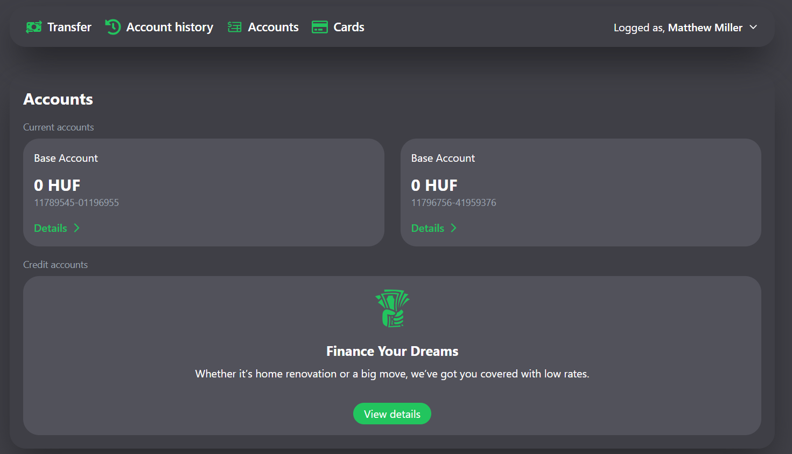
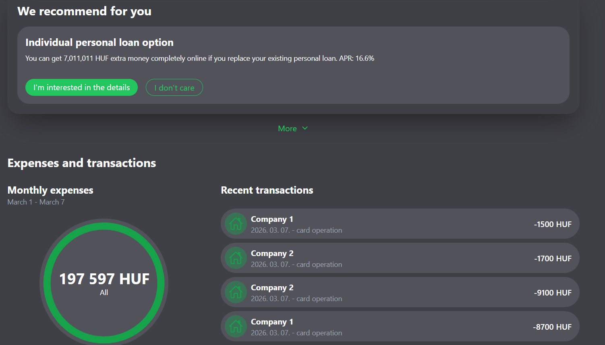

# Bank Frontend

This is the frontend for a modern banking application, built with React, TypeScript, and Vite. It provides a user-friendly interface for managing accounts, viewing transactions, and exploring financial products.

## ✨ Features

*   **User Authentication**: Secure JWT-based login and registration.
*   **Account Management**: View account balances and details.
*   **Open New Accounts**: Users can open a new bank account with a single click.
*   **Dashboard**: A central hub displaying accounts, recommended products, and transaction history.
*   **Transaction History**: A list of recent transactions.
*   **Expense Tracking**: A visual representation of monthly expenses using a doughnut chart.
*   **Responsive Design**: The interface is built with Tailwind CSS for a seamless experience on all devices.
*   **Notifications**: Integrated toast notifications for user feedback on actions.

## ✨ Screenshots




## 🚀 Tech Stack

*   **Framework**: [React](https://react.dev/)
*   **Language**: [TypeScript](https://www.typescriptlang.org/)
*   **Build Tool**: [Vite](https://vitejs.dev/)
*   **Routing**: [TanStack Router](https://tanstack.com/router)
*   **Data Fetching & State**: [TanStack Query](https://tanstack.com/query)
*   **Styling**: [Tailwind CSS](https://tailwindcss.com/)
*   **HTTP Client**: [Axios](https://axios-http.com/)
*   **Notifications**: [React Toastify](https://fkhadra.github.io/react-toastify/)
*   **Icons**: [React Icons](https://react-icons.github.io/react-icons/) & [Heroicons](https://heroicons.com/)

## Project Structure

The project follows a feature-oriented structure to keep the codebase organized and scalable.

```
/src
├── api/          # Axios client configuration and interceptors.
├── auth/         # Authentication logic, context, provider, and hooks.
├── components/   # Reusable React components used across the application.
├── routes/       # Page components for different routes (e.g., login, register, dashboard).
├── index.css     # Global styles and Tailwind CSS imports.
├── main.tsx      # Main application entry point.
└── router.tsx    # TanStack Router configuration and route tree definition.
```

## ⚙️ Getting Started

### Prerequisites

*   Node.js (v18 or later)
*   npm or another package manager
*   A running instance of the corresponding [bank-backend](https://github.com/mateqh/bank-backend) service on `http://localhost:8080`.

### Installation & Setup

1.  **Clone the repository:**
    ```bash
    git clone https://github.com/mateqh/bank-frontend.git
    cd bank-frontend
    ```

2.  **Install dependencies:**
    ```bash
    npm install
    ```

3.  **Ensure the backend is running.** The API client is configured to connect to `http://localhost:8080` as defined in `src/api/client.ts`.

4.  **Run the development server:**
    ```bash
    npm run dev
    ```

The application will be available at `http://localhost:5173`.

## 📜 Available Scripts

This project includes the following scripts defined in `package.json`:

*   `npm run dev`: Starts the Vite development server with Hot Module Replacement (HMR).
*   `npm run build`: Compiles and bundles the application for production into the `dist` directory.
*   `npm run lint`: Lints the project files using ESLint.
*   `npm run preview`: Starts a local server to preview the production build.